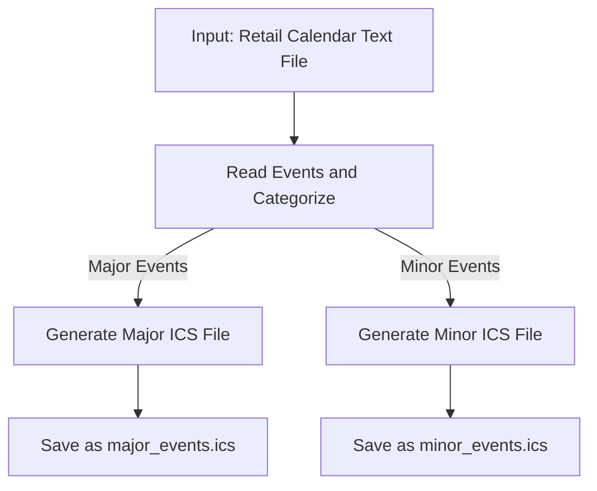
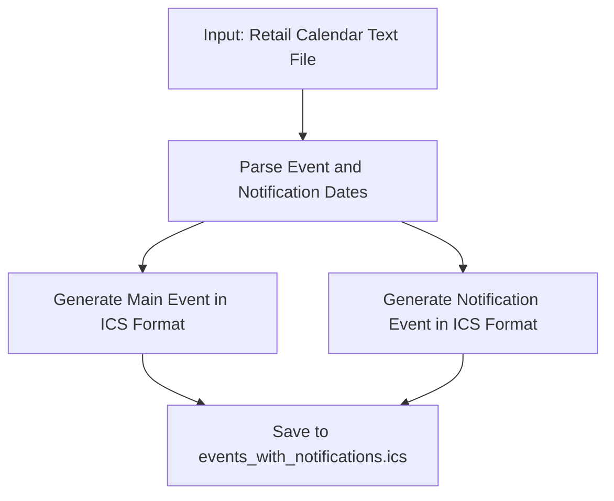

<h1 align="center">🗓️ <a href="https://github.com/ronknight/Text-to-Google-Calendar-CSV-Converter-Retail-Calendar">Text to Google Calendar CSV/ICS Converter</a></h1>

<h4 align="center">🔧 A Python-based system that converts retail event calendars (tab-delimited text files) into Google Calendar-compatible ICS files with notifications for both major and minor events.</h4>

<p align="center">
<a href="https://twitter.com/PinoyITSolution"></a>
<a href="https://github.com/ronknight?tab=followers"></a>
<a href="https://github.com/ronknight/ronknight/stargazers"></a>
<a href="https://github.com/ronknight/ronknight/network/members"></a>
<a href="https://youtube.com/@PinoyITSolution"></a>
<a href="https://github.com/ronknight/Text-to-Google-Calendar-CSV-Converter-Retail-Calendar/issues"></a>
<a href="https://github.com/ronknight/Text-to-Google-Calendar-CSV-Converter-Retail-Calendar/blob/master/LICENSE"></a>
<a href="https://github.com/ronknight"></a>
</p>

<p align="center">
  <a href="#project-overview">Project Overview</a> •
  <a href="#files">Files</a> •
  <a href="#installation">Installation</a> •
  <a href="#usage">Usage</a> •
  <a href="#retail-calendar-content">Retail Calendar Content</a> •
  <a href="#visualization">Visualization</a> •
  <a href="#disclaimer">Disclaimer</a>
</p>

---

## 📋 Project Overview

This project provides tools to convert tab-delimited retail event calendar text files into **Google Calendar ICS files**. It distinguishes between **major events** and **minor events**, categorizing them and generating notifications ahead of event dates.

**Features**:
- Generates separate ICS files for **major** and **minor events**.
- Creates **notification reminders** 1-3 months in advance for major events.
- Handles input files in **tab-delimited text format**.

---

## 📝 Files

| File Name                         | Description                                                                 |
|-----------------------------------|-----------------------------------------------------------------------------|
| `txt_to_ics_converter_internal.py` | Converts text files into **separate ICS files** for major and minor events. |
| `txt_to_ics_converter_external.py` | Creates **ICS files with notifications** for each event.                    |

---

## 🛠️ Installation

To set up this project locally:

1. Clone the repository:
   ```bash
   git clone https://github.com/ronknight/Text-to-Google-Calendar-CSV-Converter-Retail-Calendar.git
   cd Text-to-Google-Calendar-CSV-Converter-Retail-Calendar
   ```

2. Install dependencies:
   ```bash
   pip install python-dateutil
   ```

---

## 🚀 Usage

### **1. Generating ICS Files for Major and Minor Events**

Use the `txt_to_ics_converter_internal.py` script:

```bash
python txt_to_ics_converter_internal.py
```

- Input file: `retail-calendar-2025-final.txt`
- Outputs:
  - `major_events.ics` (Major events)
  - `minor_events.ics` (Minor events)

### **2. Generating ICS Files with Notifications**

Use the `txt_to_ics_converter_external.py` script:

```bash
python txt_to_ics_converter_external.py
```

- Input file: `retail-calendar-2025-final.txt`
- Output:
  - `events_with_notifications.ics` (ICS file with notifications for events)

---

## 📊 Retail Calendar Content

The file `retail-calendar-2025-final.txt` contains events and was curated from a 3rd-party website. It was processed both by AI tools and manually to select content relevant to **4sgm.com**.

### **Content of retail-calendar-2025-final.txt**

| Notification Date | Event Date   | Event                         |
|-------------------|--------------|-------------------------------|
| 01-Oct-2024       | 01-Jan-2025  | New Year's Day                |
| 14-Nov-2024       | 14-Feb-2025  | Valentine's Day               |
| 20-Jan-2025       | 20-Mar-2025  | First Day of Spring           |
| 25-Jan-2025       | 25-Mar-2025  | International Waffle Day      |
| 01-Feb-2025       | 01-Apr-2025  | April Fool's Day              |
| 20-Jan-2025       | 20-Apr-2025  | Easter Sunday                 |
| 10-Feb-2025       | 10-May-2025  | National Apple Pie Day        |
| 11-Feb-2025       | 11-May-2025  | World Fair Trade Day          |
| 14-Feb-2025       | 14-May-2025  | National Biscuit Day          |
| 21-Feb-2025       | 21-May-2025  | National Pizza Day            |
| 04-Mar-2025       | 04-Jun-2025  | National Cheese Day           |
| 08-Apr-2025       | 08-Jul-2025  | World Chocolate Day           |
| 04-May-2025       | 04-Aug-2025  | International Beer Day        |
| 08-Jun-2025       | 08-Aug-2025  | International Cat Day         |
| 12-Jun-2025       | 12-Aug-2025  | International Youth Day       |
| 19-Jun-2025       | 19-Aug-2025  | World Photography Day         |
| 26-Jun-2025       | 26-Aug-2025  | Women's Equality Day          |
| 31-Jul-2025       | 31-Aug-2025  | National Eat Outside Day      |
| 05-Jul-2025       | 05-Sep-2025  | International Day of Charity  |
| 06-Jul-2025       | 06-Sep-2025  | Read a Book Day               |
| 21-Jul-2025       | 21-Sep-2025  | International Day of Peace    |
| 23-Jul-2025       | 23-Sep-2025  | First Day of Autumn           |
| 29-Jul-2025       | 29-Sep-2025  | World Heart Day               |
| 04-Aug-2025       | 04-Oct-2025  | World Animal Day              |
| 10-Aug-2025       | 10-Oct-2025  | World Mental Health Day       |
| 16-Aug-2025       | 16-Oct-2025  | World Food Day                |
| 31-Aug-2025       | 31-Oct-2025  | Halloween                     |
| 01-Sep-2025       | 01-Nov-2025  | All Saints' Day               |
| 11-Sep-2025       | 11-Nov-2025  | Remembrance Day               |
| 26-Sep-2025       | 26-Nov-2025  | Thanksgiving (US)             |
| 27-Sep-2025       | 27-Nov-2025  | Black Friday                  |
| 01-Oct-2025       | 01-Dec-2025  | World AIDS Day                |
| 10-Oct-2025       | 10-Dec-2025  | Human Rights Day              |
| 25-Oct-2025       | 25-Dec-2025  | Christmas Day                 |
| 31-Oct-2025       | 31-Dec-2025  | New Year's Eve                |

---

## 📊 Visualization

### Workflow for `txt_to_ics_converter_internal.py`:



### Workflow for `txt_to_ics_converter_external.py`:



---

## ⚠️ Disclaimer

This project processes date-sensitive retail calendars and generates notification files. Ensure that the input text files are correctly formatted. Always validate generated ICS files before importing them into calendar applications.